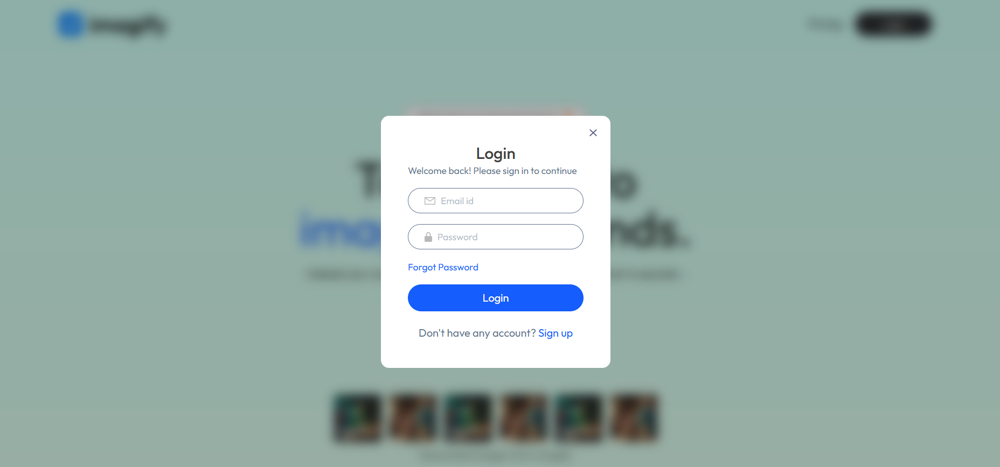
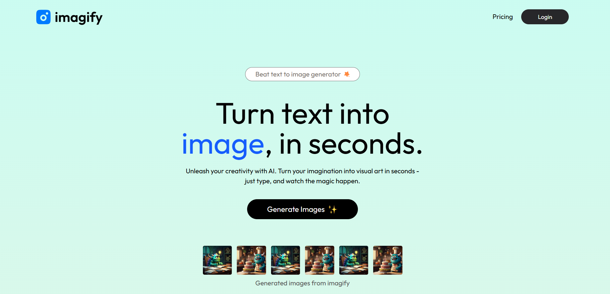
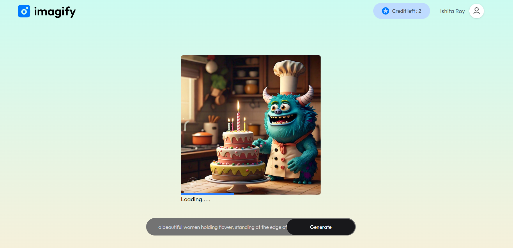
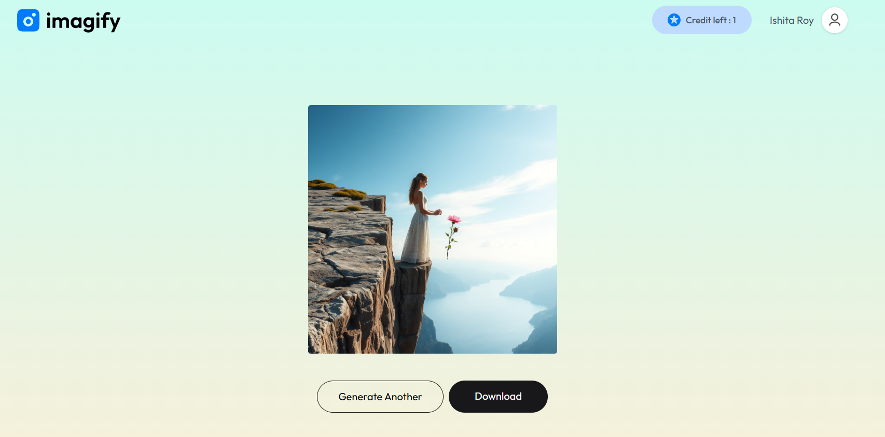

# 🎨 Imagify — AI Image Generation SaaS Platform


**Imagify** is a high-performance, full-stack **MERN SaaS application** that converts text prompts into stunning AI-generated images.  
It features **secure authentication**, a **credit-based usage system**, and a **modern animated UI** built for scalability and real-world deployment.

---

## 🖼️ Screenshots

### 🔐 Authentication


### 🎨 AI Image Generation Dashboard


### ⚡ Image Generation in Progress


### 📥 Download Generated Image


---

## ✨ Features & Highlights

### 💻 Frontend — *The Creative Studio*
- 🧠 **AI Prompt Workspace** for real-time image generation
- 📊 **Dynamic Progress Indicator** during generation
- 📥 **One-Click Image Download**
- 📱 **Fully Responsive UI**
- 🎞️ Smooth animations using **Framer Motion**
- 🌐 Global state handled via **AppContext**

---

### 🛡️ Backend — *The Engine*
- 🔐 **JWT-based Authentication & Authorization**
- 🧩 Modular REST API architecture
- 💳 **Credit-Based Image Generation System**
- 🗄️ Persistent storage with **MongoDB**
- 🔒 Encrypted passwords using **bcrypt**

---

## 🛠️ Tech Stack

| Category | Technologies |
|-------|-------------|
| **Frontend** | React 19, React Router Dom, Vite, Tailwind CSS 4, Framer Motion, Axios |
| **Backend** | Node.js, Express.js, CORS |
| **Database** | MongoDB |
| **Security** | JWT, bcrypt |
| **Notifications** | React Toastify |

---

## 🔌 API Reference

### 👤 User Routes (`/api/user`)
| Method | Endpoint | Description |
|------|--------|------------|
| POST | `/register` | Register new user |
| POST | `/login` | User authentication |
| GET | `/credits` | Fetch remaining credits *(Protected)* |

### 🖼️ Image Routes (`/api/image`)
| Method | Endpoint | Description |
|------|--------|------------|
| POST | `/generate-image` | Generate AI image *(Protected)* |

---

## 🚀 Getting Started

### 1️⃣ Environment Configuration

#### Server (`server/.env`)
```env
PORT=4000
MONGODB_URI=your_mongodb_connection_string
JWT_SECRET=your_jwt_secret
```

### Client (client/.env)
```env
VITE_BACKEND_URL=http://localhost:4000
```

### 2️⃣ Installation
```
git clone https://github.com/Som7501/Imagify---Artificial-Image-Generator-website.git
cd IMAGIFY

# Server
cd server
npm install

# Client
cd client
npm install

```

### 3️⃣ Run the App
```
# Backend
cd server
npm start

# Frontend
cd client
npm run dev
```

Frontend → http://localhost:5173

Backend → http://localhost:4000

---


## 📈 Planned Features

 💳 Stripe / Razorpay Payments for credit top-ups

 🖼️ Community Gallery for sharing artwork

 📐 Advanced Image Controls

   Square / Landscape / Portrait ratios

   Prompt enhancement options

---


## 🌟 Why This Project Stands Out

  SaaS-style credit monetization model

  Clean client–server separation

  Secure production-grade authentication

  Scalable MERN architecture

  Resume & recruiter friendly

---


## 🤝 Contributing

Pull requests are welcome!
Feel free to fork the repo and improve the project.

---


## 📄 License

This project is licensed under the MIT License.

---


## ⭐ Support the Project

If you found this useful, consider giving it a star ⭐
